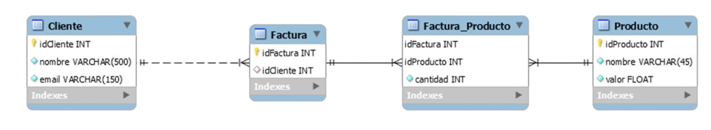

# Ejercicio Integrador 

Considere el siguiente diagrama de base de datos: 


1) Cree un programa utilizando JDBC que cree el esquema de la base de datos. 
2) Considere los CSV dados y escriba un programa JDBC que cargue los datos a la base de datos. Considere utilizar la biblioteca Apache Commons CSV, disponible en Maven central, para leer los archivos. 

```
CSVParser parser = CSVFormat.DEFAULT.withHeader().parse(new FileReader("productos.csv")); 

for(CSVRecord row: parser) { 
System.out.println(row.get("idProducto")); 
System.out.println(row.get("nombre")); 
System.out.println(row.get("valor")); 
} 
```
3) Escriba un programa JDBC que retorne el producto que más recaudó. Se define “recaudación” como cantidad de productos vendidos multiplicado por su valor.
4) Escriba un programa JDBC que imprima una lista de clientes, ordenada por a cuál se le facturó más. 